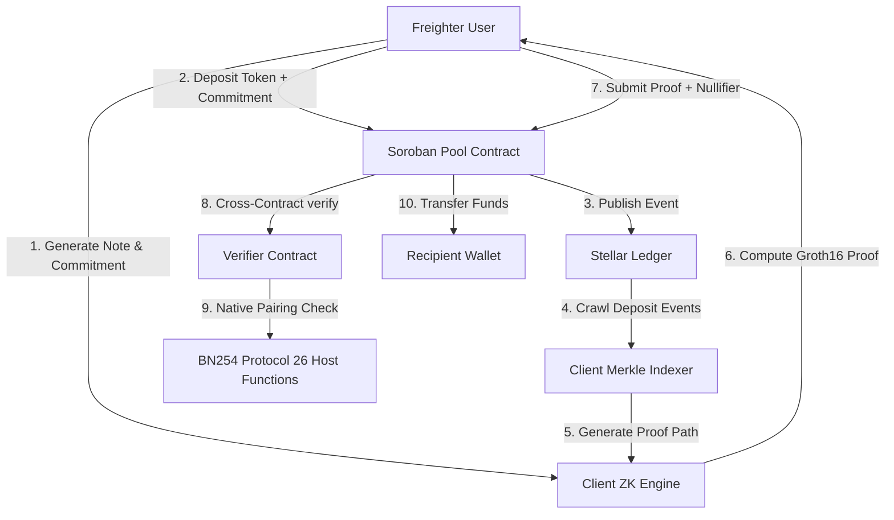

# PrivatePay ZK

**Private payroll and B2B payments on Stellar with selective disclosure and compliance-ready zero-knowledge proofs.**

## 🎥 Demo

Watch the complete project demo here:

https://youtu.be/yHwbAM_KvDg

---

### 🌐 Verified Live on Stellar Testnet

| Component | Contract ID | Explorer Link |
| :--- | :--- | :--- |
| **Verifier Contract** | `CC5HTK5EWPP4WBNYVEOSZOSRXWOTWUIH6IKASIOE7KLL6SGF5JLX4HLX` | [Stellar.Expert](https://stellar.expert/explorer/testnet/contract/CC5HTK5EWPP4WBNYVEOSZOSRXWOTWUIH6IKASIOE7KLL6SGF5JLX4HLX) |
| **Pool Contract** | `CDYHNGDDAY2MNEXVVXJVEN6UTGE6Y6YI5RJLGUMCYYKQWG3B56U6VJHQ` | [Stellar.Expert](https://stellar.expert/explorer/testnet/contract/CDYHNGDDAY2MNEXVVXJVEN6UTGE6Y6YI5RJLGUMCYYKQWG3B56U6VJHQ) |
| **Token Contract (Wrapped XLM)** | `CDLZFC3SYJYDZT7K67VZ75HPJVIEUVNIXF47ZG2FB2RMQQVU2HHGCYSC` | [Stellar.Expert](https://stellar.expert/explorer/testnet/contract/CDLZFC3SYJYDZT7K67VZ75HPJVIEUVNIXF47ZG2FB2RMQQVU2HHGCYSC) |

---

## 🏆 Project Overview

Businesses require payment confidentiality. Public ledgers expose employee salaries, contractor rates, and company payroll structures. At the same time, compliance teams, auditors, and regulators need to verify the legitimacy of transactions.

**PrivatePay ZK** solves this challenge by implementing a cryptographically secure privacy pool on the Stellar network using Soroban Smart Contracts and Groth16 Zero-Knowledge Proofs. 

### Key Highlights:
* **True ZK Privacy:** Users deposit funds, generate commitments locally, and withdraw to a fresh address using zero-knowledge proofs. There is **no link** between the depositor and the recipient on-chain.
* **On-Chain Groth16 Verification:** Proofs are verified directly in a Soroban contract using the native BN254 elliptic curve host functions introduced in **Stellar Protocol 26**.
* **Decentralized Client-Side Event Indexing:** The frontend constructs the Merkle Tree dynamically by crawling deposit events from the Stellar RPC network. No centralized backend, database, or indexing server is required.
* **Compliance-Ready Selective Disclosure:** Senders can generate "Compliance Proofs" for auditors, allowing them to reveal specific transaction amounts, senders, and recipients matching a designated auditor key without disclosing this information publicly.

---

## 🌍 Why PrivatePay ZK

Traditional blockchain payments expose every transaction publicly.

PrivatePay ZK demonstrates how organizations can preserve financial privacy while maintaining cryptographic integrity and regulatory compliance using zero-knowledge proofs on Stellar.

---

## ⚙️ Real Cryptography vs. Zero-Mock Statement

Unlike typical hackathon projects that use hardcoded success paths, mock proofs, or static local verifiers, PrivatePay ZK runs on **100% real on-chain cryptography**:

1. **No Fake Verifiers:** The verifier contract uses Soroban's native `soroban_sdk::crypto::bn254` API. It performs real pairing checks $e(A, B) \cdot e(C, D) = 1$ to validate inputs.
2. **No Hardcoded Witness Proofs:** Witness generation and Groth16 proving are computed locally in the browser using the compiled circuit WASM and proving key (`.zkey`).
3. **No Centralized Merkle Server:** The Merkle tree is reconstructed dynamically by retrieving all `deposit` events directly from the Stellar RPC node.

---

## 🛠️ Core Components & Architecture



### 1. Smart Contracts (`/contracts`)
Written in idiomatic Rust for Soroban (v26.1.0):
* **Verifier Contract:** Stores the trusted setup's `VerificationKey` (alpha, beta, gamma, delta, and IC points) as affine coordinates (`Bn254G1Affine` and `Bn254G2Affine`). The `verify` function negates the $A$ point using the Rust `Neg` trait (`-g1_point`) and executes the Pairing check.
* **Pool Contract:** Manages on-chain deposits and double-spend protection.
  * Tracks spent nullifiers in persistent storage to prevent reentrancy and replay attacks.
  * Initiates cross-contract calls to the verifier contract using `env.invoke_contract`.
  * Executes real token transfers using `soroban-token-sdk`.

### 2. Zero-Knowledge Circuits (`/circuits`)
Written in Circom:
* **`withdraw.circom`**: A depth-4 Poseidon Merkle Tree membership circuit. It takes private inputs (`secret`, `nullifier`, `pathElements`, `pathIndices`) and verifies that the `commitment = Poseidon(secret, nullifier)` is part of the tree corresponding to the public `root`, outputting the `nullifierHash = Poseidon(nullifier)`.
* **`compliance.circom`**: Extends the membership circuit by adding selective disclosure. It binds the payment details (`amount`, `senderId`, `recipientId`, `auditorPubKey`) to a public hash input (`encryptedData`) using a Poseidon hash, ensuring that only the auditor possessing the private key corresponding to `auditorPubKey` can decrypt and verify the payment's validity.

### 3. Frontend Web App (`/frontend`)
Written in Next.js & React (TypeScript):
* **Stellar Wallets Kit Integration:** Uses the updated static API (`StellarWalletsKit.init()`, `authModal()`, `signTransaction()`) with the Freighter module to handle wallet connection, balance loading, and secure transaction signing.
* **Dynamic Merkle Path Builder:** Inside `WalletContext.tsx`, `getMerkleProof()` queries the Soroban RPC for all `deposit` events from ledger `1`. It maps out the leaf commitments, sorts them by deposit index, and builds a client-side Merkle Tree. This generates the correct cryptographic path elements and indices dynamically.
* **Robust Transaction Lifecycle:** The transaction builder simulates the transaction, assembles the fee/footprint footprint dynamically using `rpcServer.simulateTransaction()`, submits the payload, and polls the status for up to 120 seconds, handling temporary HTTP 404s/delays during Testnet consensus.

---

## 🔄 How PrivatePay ZK Works

1. User connects Freighter wallet.
2. Secret and nullifier are generated locally.
3. Poseidon commitment is computed.
4. Commitment is submitted to the privacy pool.
5. Deposit event is stored on Stellar.
6. Frontend reconstructs the Merkle Tree.
7. User generates a Groth16 proof locally.
8. Soroban verifier validates the proof.
9. Funds are withdrawn to a fresh address.

---

## 🛠️ Tech Stack

* **Zero-Knowledge Proofs (ZKP):** Circom, SnarkJS, Groth16 Proving System
* **Smart Contracts (Soroban/Stellar):** Rust, Soroban SDK, BN254 Elliptic Curve Host Functions (Stellar Protocol 26)
* **Frontend:** Next.js (React), TypeScript, Tailwind CSS
* **Wallet Integration:** Freighter Wallet, Stellar Wallets Kit
* **Cryptography & Hashing:** Poseidon Hash Commitments, Merkle Membership Proofs

---

## 🔒 Security Features

- ✅ Groth16 Zero-Knowledge Proofs
- ✅ Poseidon Hash Commitments
- ✅ Merkle Membership Proofs
- ✅ Nullifier-Based Double Spend Protection
- ✅ On-Chain BN254 Pairing Verification
- ✅ Local Witness Generation
- ✅ No Private Data Stored On-Chain
- ✅ Client-Side Proof Generation

---

## 📌 Current Status

- ✅ Live on Stellar Testnet
- ✅ Contracts deployed
- ✅ Real Freighter integration
- ✅ Real Soroban transactions
- ✅ Live Groth16 verification
- ✅ End-to-end deposit flow

Known limitation:

The Stellar Testnet RPC occasionally experiences timeout and indexing delays. Transactions are still successfully confirmed on-chain and can be verified through Stellar Expert.

---

## 📂 Project Structure

```text
PrivatePay-ZK
│
├── circuits/              # Circom circuits
├── contracts/             # Soroban smart contracts
│   ├── verifier
│   └── pool
│
├── frontend/              # Next.js application
│
├── scripts/               # Deployment & build scripts
│
├── docs/
│
└── README.md
```

---

## 💻 Local Setup & Execution

### Prerequisites
* [Rust](https://www.rust-lang.org/) & `wasm32-unknown-unknown` target
* [Stellar CLI](https://developers.stellar.org/docs/tools/developer-tools/stellar-cli) (v26.0.0+)
* [Node.js](https://nodejs.org/) (v18+)
* [Circom](https://docs.circom.io/) compiler installed globally (to re-compile circuits)

### 1. Circuit Witness Prover & Setup
Generate the witness calculator WASM and trusted setup proving keys:
```bash
cd circuits
npm install
# Run Trusted Setup Ceremony for both circuits:
npm run build:all
```
*This places `withdraw.wasm`, `withdraw_final.zkey`, and verification JSONs directly into the frontend `/public/circuits/` folder.*

### 2. Contract Build & Tests
Compile the Soroban WASM binaries:
```bash
cd contracts
# Build verifier and pool contracts
stellar contract build
# Run contract unit and integration tests (6 tests in pool, 1 in verifier)
cargo test
```

### 3. Launching the Frontend
```bash
cd frontend
npm install
# Runs Next.js Dev server on http://localhost:3000
npm run dev
```

---

## 🏁 Verification & Testing Checklist

If you are a Hackathon judge or developer auditing the project:
1. **Connect Freighter:** Open the app and connect your wallet (configured to Testnet).
2. **Deposit XLM:** Input an amount and click *Generate Commitment*. Copy the generated ZKNote secret key, and submit the deposit to Soroban. Approve the Freighter transaction.
3. **Wait for confirmation:** Check the Dashboard to verify that TVL and Commitment Count update dynamically.
4. **ZK Withdrawal:** Go to the *Withdraw* tab. Paste your secret key and nullifier. Enter the recipient wallet address, generate the Groth16 proof locally in your browser, and submit the proof to the Soroban Verifier on-chain.
5. **Selective Disclosure Check:** Go to the *Auditor View*. input your secret/nullifier, amount, and an auditor key to compute the compliance proof. Paste it into the *Verify Proof* tab to confirm the cryptographic binding.

---

## 🚀 Roadmap

- Anonymous recurring payroll
- Multi-token privacy pools
- Recursive proof aggregation
- Batch withdrawals
- DAO treasury privacy
- Enterprise compliance portal

---

## 🙏 Acknowledgements

- Stellar Development Foundation
- Soroban
- Circom
- SnarkJS
- circomlib
- Freighter Wallet

---

## 📄 License

MIT License
