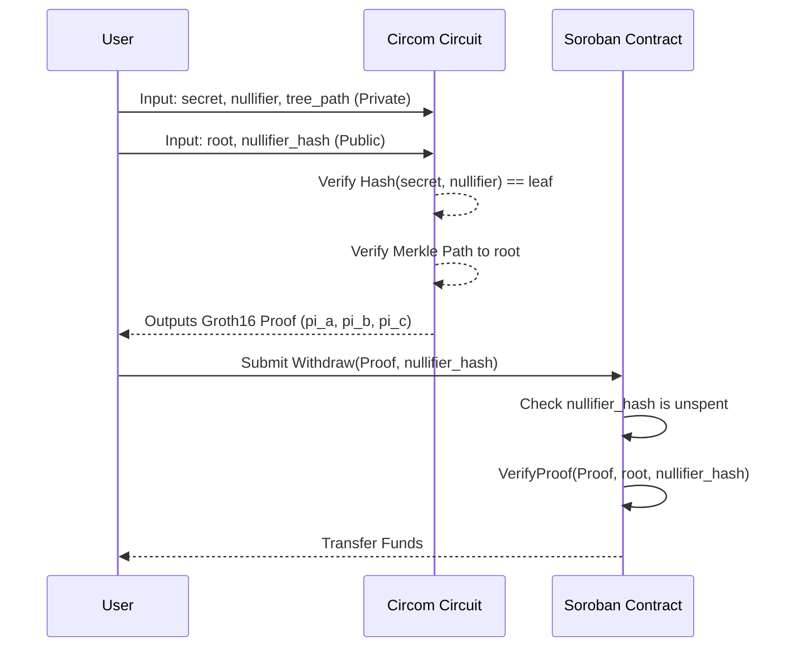
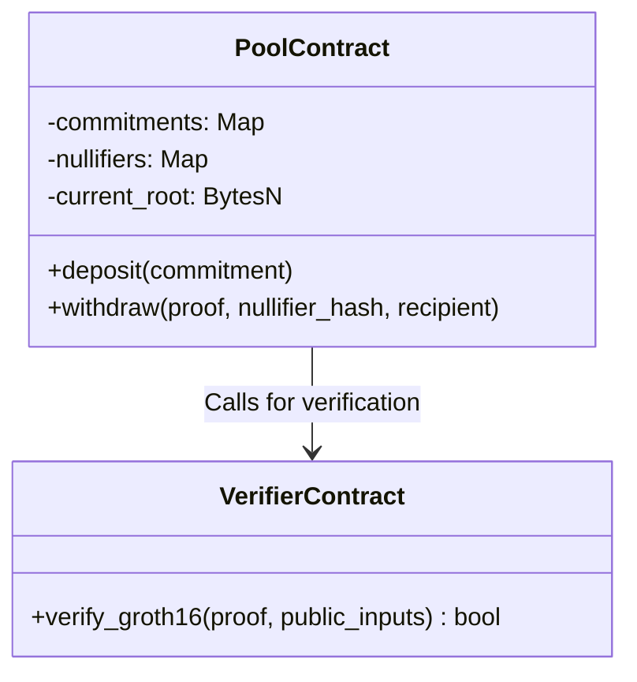

# PrivatePay ZK Architecture

## System Architecture

```mermaid
graph TD
    User[User/Browser] --> |1. Generates Commitment| UI[Next.js Frontend]
    UI --> |2. Deposit (Commitment)| Soroban[Soroban Pool Contract]
    Soroban --> |Stores| MerkleTree[(On-chain Merkle Tree)]
    
    User2[Employee/Browser] --> |3. Fetches Tree Data| UI2[Next.js Frontend]
    UI2 --> |4. Generates ZK Proof| Circom[Circom / SnarkJS Client]
    Circom --> |5. Submits Proof + Nullifier| Soroban
    Soroban <--> |6. Verify Proof| Verifier[Soroban ZK Verifier]
    Verifier --> |7. Valid| Soroban
    Soroban --> |8. Transfer Funds| User3[Fresh Wallet]
```

## ZK Circuit Flow



## Soroban Contract Interaction


